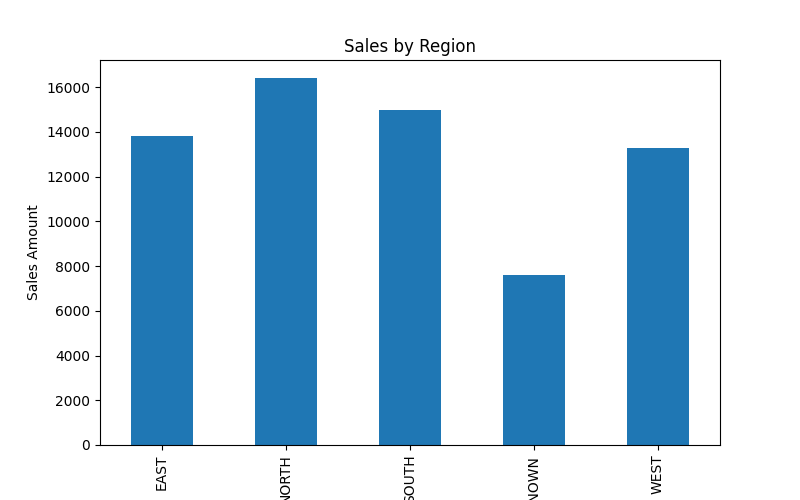
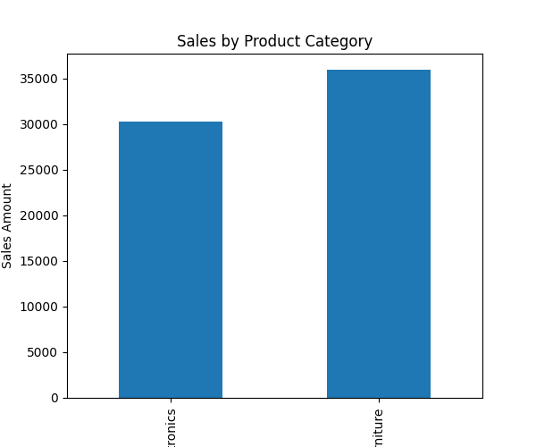
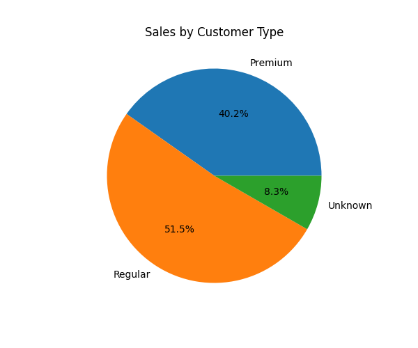

# Data Cleaning & Reporting Automation

## Project Overview

This project automates the process of data cleaning, preprocessing, and report generation using Python. The workflow handles missing values, removes duplicate records, standardizes inconsistent data, generates business reports, and creates visual summaries for analysis.

## Objectives

* Identify and handle missing values.
* Detect and remove duplicate records.
* Standardize inconsistent data formats.
* Generate automated business reports.
* Create visual summaries for decision-making.
* Export cleaned datasets and reports automatically.

## Technologies Used

* Python
* pandas
* matplotlib

## Dataset Features

* Product ID
* Sale Date
* Sales Representative
* Region
* Sales Amount
* Quantity Sold
* Product Category
* Customer Type

## Project Workflow

1. Load CSV dataset.
2. Inspect dataset structure and data types.
3. Detect missing values.
4. Handle missing values using appropriate techniques.
5. Identify and remove duplicate records.
6. Standardize inconsistent text values.
7. Generate automated reports.
8. Create visualizations.
9. Export cleaned data and reports.

## Data Cleaning Performed

### Missing Value Handling

* Filled missing Sales Amount values using the column mean.
* Filled missing Region values with "Unknown".
* Filled missing Customer Type values with "Unknown".

### Duplicate Removal

* Identified and removed duplicate records automatically.

### Data Standardization

* Converted Region names to uppercase.
* Standardized inconsistent values such as:

  * South → SOUTH
  * south → SOUTH
  * EAST → EAST

## Automated Reports Generated

### Sales by Region

* NORTH: 16,400
* SOUTH: 15,000
* EAST: 13,830
* WEST: 13,300
* UNKNOWN: 7,600

### Sales by Product Category

* Furniture: 35,900
* Electronics: 30,230

### Sales by Customer Type

* Regular: 34,030
* Premium: 26,600
* Unknown: 5,500

## Visualizations

The project generates:

* Sales by Region Bar Chart
* 
* Sales by Product Category Bar Chart
* 
* Customer Type Distribution Pie Chart
* 

## Output Files

```text
cleaned_sales_data.csv
sales_by_region.csv
sales_by_category.csv
sales_by_customer_type.csv
sales_by_region.png
sales_by_category.png
sales_by_customer_type.png
```

## Business Insights

* North region generated the highest sales.
* Furniture category generated more revenue than Electronics.
* Regular customers contributed the highest sales volume.

## Learning Outcomes

* Data Cleaning
* Data Preprocessing
* Missing Value Treatment
* Duplicate Handling
* Automated Reporting
* Data Visualization
* Business Insight Generation

## Future Enhancements

* Interactive Power BI Dashboard
* Automated Excel Report Generation
* Scheduled Reporting Automation
* Advanced Data Quality Checks
* Email-based Report Delivery
